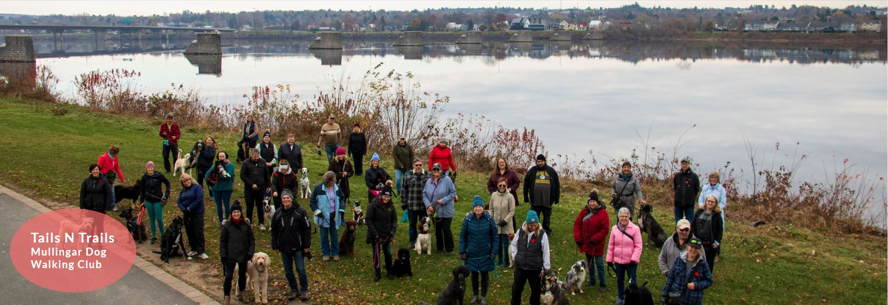
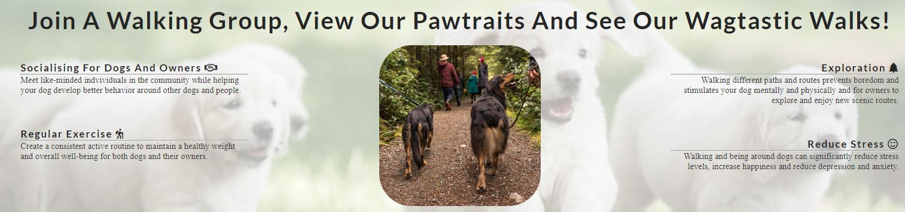
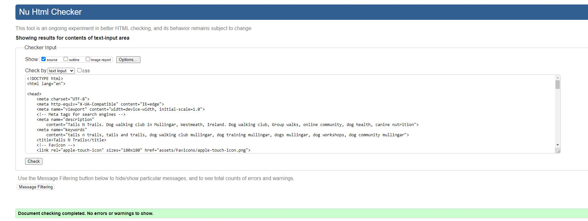
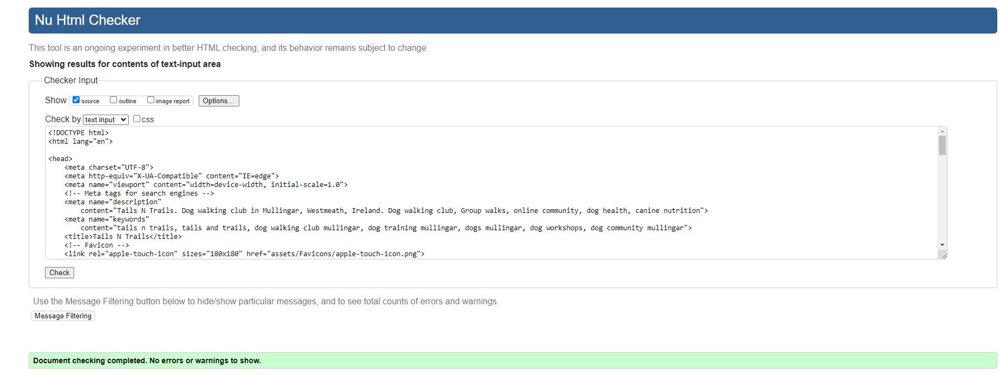
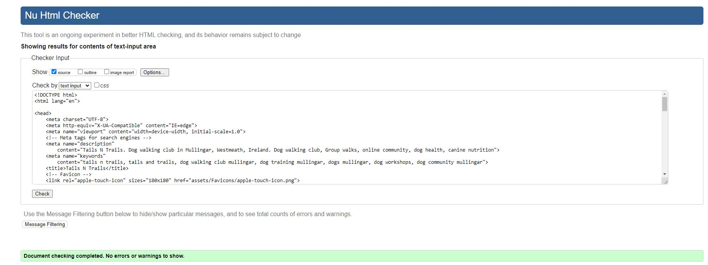

# **Tails N Trails**

Welcome to the Tails n Trails! Our community is dedicated to bringing dog owners together for regular walks, fostering a friendly environment where both dogs and their owners can enjoy socialising, exploring, and staying active. We are based in the beautiful town of Mullingar, Co. Westmeath, Ireland, and we invite you to join us in our adventures.

    
  

## **Website Overview**

Our website is designed to provide you with all the information you need to join our group and start enjoying the many benefits of walking with your dog. Here’s a brief overview of what you’ll find:

### **Existing Features**

- **Nagivation Bar**

  - A fully responsive navigation bar can be seen across all three pages. It includes links to the Home page, Gallery (Pawtraits), and Sign-Up page, and it's identical on each page. This design ensures that users can effortlessly navigate from page to page across all devices without the arduous task of hitting the ‘back’ button.

  

    
  

- **Home Page**

    On the home page, you’ll find a welcome and an introduction to our group. I highlight several perks of joining the Mullingar Dog Walking Club, Tails N Trails, including:

    - Socialising: Meet other dog lovers and their pets, making new friends along the way.
    - Exploration: Discover new walking trails and beautiful scenery around Mullingar.
    - Reducing Stress: Enjoy the calming effects of nature and the joy of spending time with dogs.
    - Exercise: Keep both you and your dog fit and healthy with regular walks.
 
   

    
  

   
- **The Footer**

    - The footer section includes links to the relevant social media sites for Tails N Trails. The links will open to a new tab to allow easy navigation for the user.
    - The footer is valuable to the user as it encourages them to keep connected via social media.
    

       
    

## **Validator Testing**

- HTML
    - No errors were returned when passing through the official W3C validator
    

       
    

    

       
    

    

       
    

- CSS
    - No errors were found when passing through the official (Jigsaw) validator
    

       
    

- Unfixed Bugs
    - Gallery page needs to be improved for responsiveness, not behaving as expected in some screen sizes

## **Credits**

### **Content**

* Home Page Design:

     - My project was based on Love Running walkthrough project, where I gained knowledge for the coding used in Tails N Trails project.
     - Used the following website to change the opacity of the homepage background photo "https://www.luxa.org/image/change-opacity"
  

* Readme File:
    - Used chat GPT to word "https://chatgpt.com/"

### **Media**

* Home Page:
    - "Dog's Walks & More" Facebook.com 
    - https://www.earthbath.com/blogs/earthbath-blog/dog-walking-etiquette 
* Gallery Page:
    - https://depositphotos.com/photos/dog-walking.html
* Sign Up Page:
    - https://www.dailymail.co.uk/news/article-10298353/Walking-dog-better-combating-stress-strolling-alone.html
